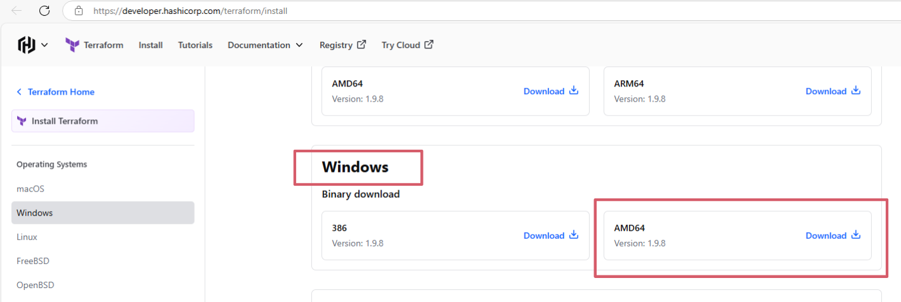
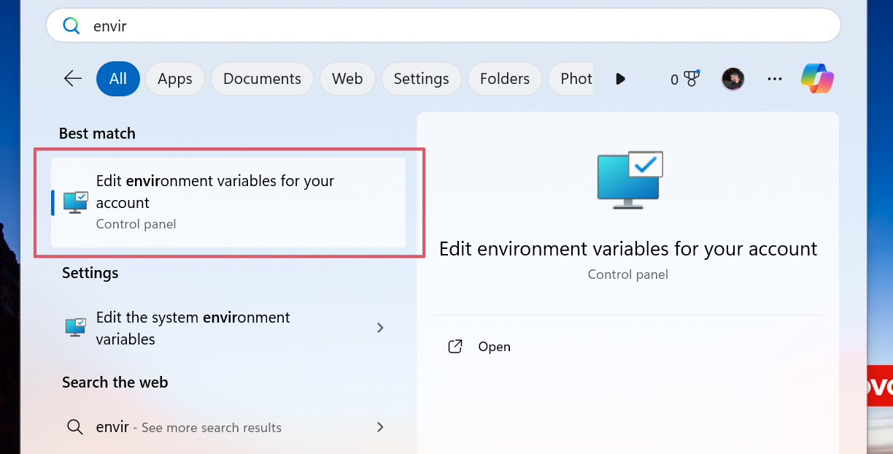
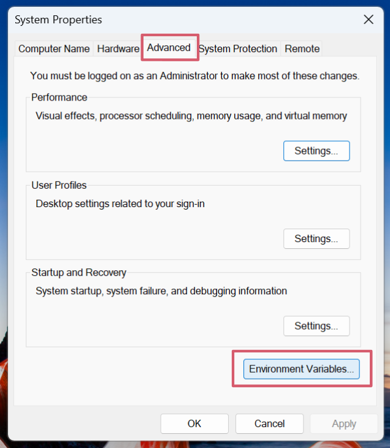
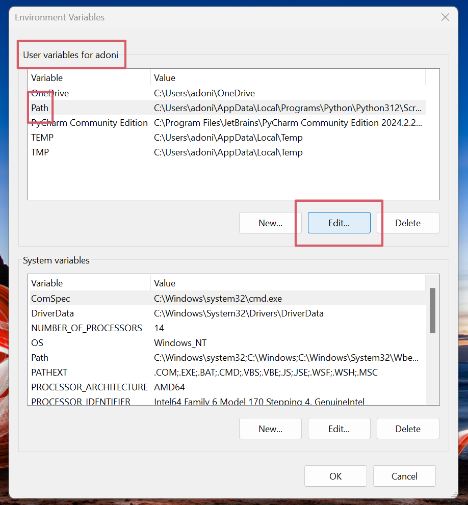
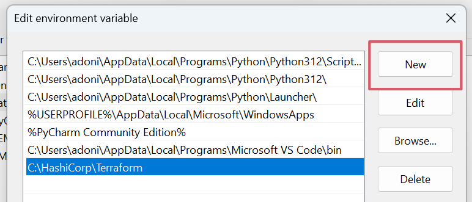

# Learning Terraform

- [Learning Terraform](#learning-terraform)
  - [Download Terraform on Windows](#download-terraform-on-windows)
  - [Adding Terraform Path to System Environment Variables](#adding-terraform-path-to-system-environment-variables)
  - [What is Terraform? What is it used for?](#what-is-terraform-what-is-it-used-for)
  - [Why use Terraform? The benefits?](#why-use-terraform-the-benefits)
  - [Alternatives to Terraform](#alternatives-to-terraform)
  - [Who is using Terraform in the industry?](#who-is-using-terraform-in-the-industry)
  - [In IaC, what is orchestration? How does Terraform act as "orchestrator"?](#in-iac-what-is-orchestration-how-does-terraform-act-as-orchestrator)
  - [Best practice supplying AWS credentials to Terraform](#best-practice-supplying-aws-credentials-to-terraform)
  - [Terraform AWS credentials lookup order (precedence)](#terraform-aws-credentials-lookup-order-precedence)
  - [Best practice to supply AWS credentials](#best-practice-to-supply-aws-credentials)
  - [How should AWS credentials never be passed to Terraform?](#how-should-aws-credentials-never-be-passed-to-terraform)
  - [Why use Terraform for different environments (e.g. production, testing, etc.)?](#why-use-terraform-for-different-environments-eg-production-testing-etc)

## Download Terraform on Windows

1. Browse to the Download Terraform page https://developer.hashicorp.com/terraform/install.
2. Look for the Windows download link.<br>
<br>
3. Unzip the downloaded file. For example, use the C:\Hashicorp\Terraform path. Remember this location so you can add the path to the environment variables.

## Adding Terraform Path to System Environment Variables

1. Open the Windows start menu, start typing environment and click **Edit system environment variables**. The System Properties window opens.<br><br>
2. Click the Environment Variables.<br><br>
3. Select the **Path** variable in the **System variables** section to add terraform for all accounts. Alternatively, select **Path** in the **User variables** section to add terraform for the currently logged-in user only. Click **Edit** once you select a Path.<br><br>
4. Click **New** in the edit window and enter the location of the Terraform folder (eg. C:\Hashicorp\Terraform).<br><br>
5. Click **OK** on all windows to apply the changes.
6. Verify installation by opening a new commant-prompt window and checking the Terraform version.

```bash
terraform -version
```

## What is Terraform? What is it used for?

Terraform is an open-source Infrastructure as Code (IaC) tool developed by HashiCorp. It allows users to define, manage, and provision infrastructure using a declarative configuration language (HCL). Terraform is used to automate the creation, modification, and destruction of cloud resources across various providers like AWS, Azure, and GCP.

## Why use Terraform? The benefits?

* Multi-cloud support: Manages infrastructure across different cloud providers.
* Declarative syntax: Infrastructure is defined in simple, human-readable code.
* Version control: Infrastructure changes can be tracked in version control systems.
* Scalability: Automates infrastructure at any scale.
* State management: Keeps a record of the current infrastructure state.
* Reusable modules: Infrastructure can be modularized and reused.

## Alternatives to Terraform

* AWS CloudFormation
* Pulumi
* Ansible
* Chef
* SaltStack
* Google Cloud Deployment Manager

## Who is using Terraform in the industry?

Companies like Netflix, Uber, Airbnb, Expedia, and Samsung are known to use Terraform for managing their infrastructure.

## In IaC, what is orchestration? How does Terraform act as "orchestrator"?

Orchestration refers to automating and managing multiple interconnected resources or services. Terraform acts as an orchestrator by managing the dependencies between resources and executing them in the correct order, ensuring that infrastructure is provisioned or updated properly.

## Best practice supplying AWS credentials to Terraform

* IAM roles: For services like EC2 or ECS, use IAM roles instead of passing credentials directly. This is more secure and avoids exposing sensitive information.
* Environment variables: Set AWS credentials in your environment using variables like AWS_ACCESS_KEY_ID and AWS_SECRET_ACCESS_KEY.
* Credentials file: Use the AWS credentials file (~/.aws/credentials) to store credentials and reference profiles.
* AWS SSO: Leverage AWS Single Sign-On for secure access without embedding credentials in your infrastructure code.

## Terraform AWS credentials lookup order (precedence)

1. Environment variables (AWS_ACCESS_KEY_ID, AWS_SECRET_ACCESS_KEY)
2. AWS credentials file (~/.aws/credentials)
3. AWS config file (~/.aws/config)
4. EC2 instance profile or ECS container credentials
5. AWS Vault, AWS SSO

## Best practice to supply AWS credentials

Use IAM roles or AWS SSO for secure, managed access.

## How should AWS credentials never be passed to Terraform?

AWS credentials should never be hard-coded directly in Terraform configuration files or embedded within the source code. Always avoid exposing sensitive information in plaintext within your codebase.

## Why use Terraform for different environments (e.g. production, testing, etc.)?

Terraform allows for consistent infrastructure deployment across environments (production, testing, staging). By using separate workspaces or configuration files, teams can ensure infrastructure consistency while managing environment-specific variations efficiently. This reduces human error and enhances automation.